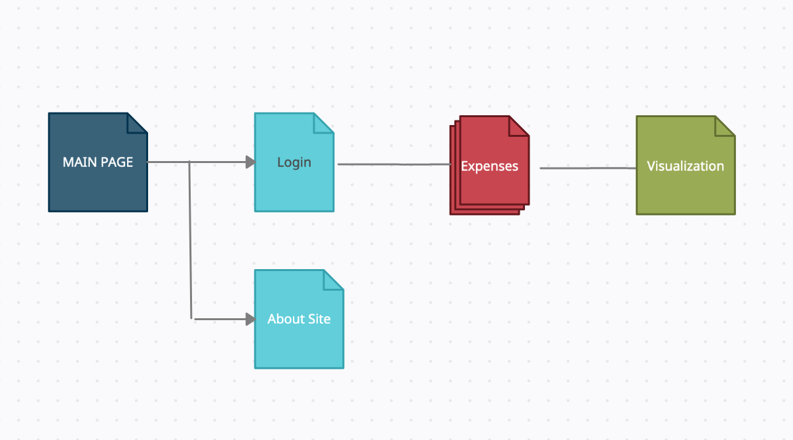

# PixelTracker

## Overview

Ever find yourself overspending and not realizing it until the end of the month? Or only having a vague sense of how much you've spent? That's what PixelTracker is focused on preventing, a handy way to track and visualize your expenses!

Pixel Tracker is a web app that will allow users to track their expenses once added. Users can register and login. Once they're logged in, they can add expenses by name and amount, along with categories. For each category, they can visualize expenses at the end of the month, and receive analytics in order to better optimize spending int he future.

## Data Model

The application will store Users, Categories, and Items

* users can have multiple categories (via references)
* each category can have multiple items (by embedding)

An Example User:

```javascript
{
  username: "shopaholic222",
  hash: // a password hash,
  categories: // an array of references to Category documents
}
```

An Example Category with Embedded Items:

```javascript
{
  user: // a reference to a User object
  name: "fun",
  items: [
    { name: "Minecraft", price: "14.99", date: "10/23" },
    { name: "Batman Ticket", price: "12.99", date: "10/24"},
  ],
  createdAt: // timestamp
}
```

## [Link to Commented First Draft Schema](db.js) 

## Wireframes

/login - page for login


/expenses - page for showing all expenses in a list


/expenses/visualizations - page for visualizing expenses over time and by category


## Site map



## User Stories or Use Cases

1. as non-registered user, I can register a new account with the site
2. as a user, I can log in to the site
3. as a user, I can create categories to label my expenses with
4. as a user, I can view all of my expenses in a single list
5. as a user, I can add expenses under each category
6. as a user, I can visualize expenses weekly/monthly in total or by category

## Research Topics

* (3 points) Integrate user authentication
    * I'm going to be using passport for user authentication
    * Passport is an authentication middleware for node.js, which can be seamlessly implemented into my express application
    * will probably use passport-http-bearer strategy since it seems popular and can easily be implemented into express
* (5 points) d3.js
    * I will use d3.js to visualize expense data
    * d3 is a javascript library for visualizing data using web standards, so it's a great way to make data look readable and visually appealing
    * will use d3.js with observable, since it seems like the most popular method
    * d3 is a challenging library so I've assigned it 5 points, although subject to change
* (3 points) vue.js
    * vue is a frontend framework that is really good for one-page applications and is a view-oriented product
    * it is very simple to create a one-page application, which is good for my app because it will be focused on the expenses page
    * it is able to update small parts of pages easily, as entire page does not have to be refreshed, may be useful for adding expenses individually

12 points total out of 8 required points.

## [Link to Initial Main Project File](app.js) 

## Annotations / References Used

1. [passport.js authentication docs](http://passportjs.org/docs)
2. [tutorial on vue.js](https://vuejs.org/v2/guide/)
3. [introduction to d3.js] (https://observablehq.com/@d3/learn-d3)

